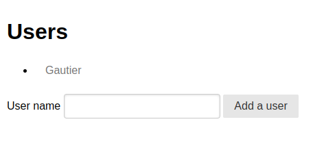
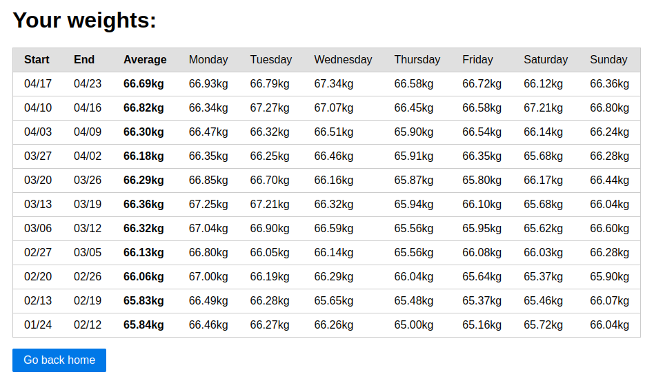

# withings-weights

Compute Withings week's average weight.

## Motivation

* Withings does not expose week's average weight (neither through the app or the web ui, only weekly summary was doing so, but it's not sent anymore)
* I had a limited time (1-3 days + nights), so no:
  * tests
  * good code organization
  * strong types
  * design
  * structured logs
  * proper account management
  * i18n (weeks from Monday to Sunday, kilograms as unit)
  * corner cases management (only the first weight of the day is taken)
* Feel free to contribute

## Build-it

```
nix build '.#packages.x86_64-linux.withings-weights-image'
docker load -i result
```

## Run-it

Create an application on [Withings Developer Dashboard](https://developer.withings.com/dashboard/) and source the values in your environment variables to run the container:

```
docker run --rm -v $PWD:/store -p 8000:80 -e OAUTH_CALLBACK_URL -e OAUTH_CLIENT_ID -e OAUTH_CLIENT_SECRET ghcr.io/blackheaven/withings-weights:latest
```

## Overview



